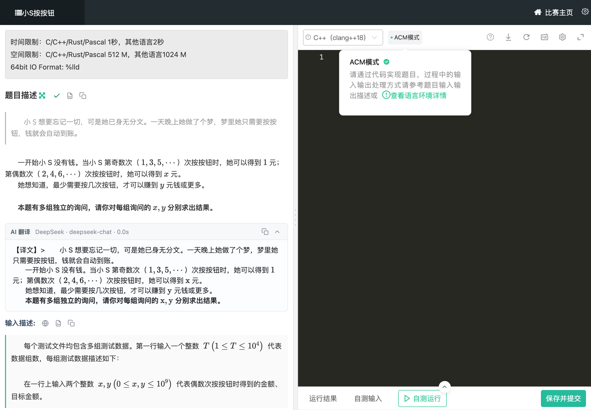
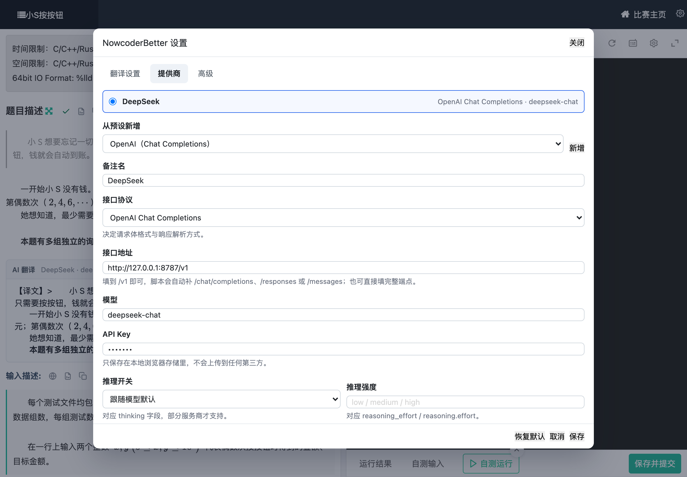

# NowcoderBetter

[](https://github.com/hsn8086/NowcoderBetter/releases)
[](LICENSE)
[](dist/nowcoder-better.user.js)

牛客竞赛（ac.nowcoder.com）增强油猴脚本。主要功能是把英文题面翻译成中文，翻译由你自己配置的 AI 接口完成，支持 OpenAI Chat Completions、OpenAI Responses、Anthropic Messages 三种协议，以及任意兼容 OpenAI 的自定义服务商。



> 当前版本 0.1.0，只在 `ac.nowcoder.com` 的题目页验证过。功能还在陆续增加。

## 功能

- **AI 题面翻译**：题目描述、输入/输出描述、题解各自一个翻译按钮，译文显示在正文下方，可重新翻译、复制、收起。
- **公式不丢**：牛客把公式渲染成 `equation?tex=` 图片，脚本会还原成 LaTeX 交给模型，翻译后用 KaTeX 重新渲染。
- **Markdown 视图 / 复制原文**：把题目区域转成 Markdown，方便粘贴到笔记或题解里。
- **多提供商管理**：可保存多套配置随时切换，支持自定义接口地址、模型、额外请求头、额外请求体字段、推理开关。
- **长题面分段**：关闭「整段翻译」后按标题和段落切块依次翻译，适配上下文窗口较小的模型。

工具栏是内联图标，挂在每个标题右边：

| 图标 | 作用 |
| --- | --- |
| 地球 | AI 翻译。翻译中变成转圈，可点击中止；完成变对勾 |
| 文档 | 切换 Markdown 视图 / 返回原始内容 |
| 剪贴板 | 复制该区域的 Markdown |

设置入口只有一个，在页面右上角。

## 安装

需要先装 [Tampermonkey](https://www.tampermonkey.net/)（或 Violentmonkey）。

| 版本 | 安装地址 |
| --- | --- |
| 正式版 | [nowcoder-better.user.js](https://raw.githubusercontent.com/hsn8086/NowcoderBetter/main/dist/nowcoder-better.user.js) |
| 开发版 | 本地构建，见下方「开发」 |

卸载：在脚本管理器的管理面板里删除 `NowcoderBetter` 即可，本地保存的配置也会一并清除。

## 第一次使用

1. 打开任意牛客题目页，点右上角的齿轮图标。
2. 在「提供商」页从预设里选一个（OpenAI / Anthropic / DeepSeek / OpenRouter 等），填入 API Key。
3. 点「测试连接」确认能通，再点「保存」。
4. 回到题目，点标题旁边的翻译图标。

设置面板长这样：



### 三种协议怎么选

| 协议 | 接口路径 | 请求体 | 认证头 |
| --- | --- | --- | --- |
| OpenAI Chat Completions | `/chat/completions` | `messages` | `Authorization: Bearer` |
| OpenAI Responses | `/responses` | `input` | `Authorization: Bearer` |
| Anthropic Messages | `/messages` | `system` + `messages` | `x-api-key` |

「接口地址」填到 `/v1` 即可，脚本会按协议补全后面的路径；也可以直接填完整端点，脚本识别到已含端点就原样使用。

默认模型是 `gpt-6-luna`。`temperature`、`top_p`、`max_tokens` 这类参数不在表单里单独列，统一写到「额外请求体字段」的 JSON 里，会合并进请求体。

## 密钥与请求路径

API Key 通过 `GM_setValue` 存在浏览器的脚本存储里，译文请求由脚本用 `GM_xmlhttpRequest` 直接发给你填的接口地址，中间没有本项目提供的任何转发服务。

`GM_xmlhttpRequest` 这一层很关键：它不受页面同源策略限制。如果脚本没能拿到这个 API（比如在普通浏览器里直接引入构建产物），请求会退化成 `fetch`，于是被 CORS 拦下，设置面板的「测试连接」会报 `Failed to fetch`。此时页面右下角会有一条提示。

可以自己验证：打开设置 → 「高级」，配置预览里的 Key 被替换成了 `***`；真正的请求只出现在浏览器开发者工具的 Network 面板，目标地址就是你填的接口地址。

> 构建产物里内置了 KaTeX 的 JS，KaTeX 的字体会在页面首次出现公式时从 jsDelivr 的 CSS 加载。除此之外没有别的外部请求。如果不想连 CDN，可以改 `src/markdown.ts` 里的 `KATEX_CSS_URL`。

## 开发

```bash
pnpm install
pnpm dev          # 开发模式，输出 dist/nowcoder-better.user.js（监听重构建）
pnpm build        # 生产构建
pnpm typecheck    # 类型检查
pnpm test         # 单元测试（协议拼包、分段、配置迁移）
```

目录结构：

```
src/
  main.ts             入口，挂载工具栏与设置入口
  inject.ts           扫描页面区域、注入图标按钮、绑定翻译流程
  translate.ts        翻译编排与结果面板
  prompt.ts           提示词与分段逻辑
  providers.ts        三种协议的请求构造与响应解析
  ai.ts               重试、错误处理、测试连接
  markdown.ts         HTML ↔ Markdown，公式还原与 KaTeX 渲染
  nowcoder.ts         牛客页面选择器
  settings-panel.ts   设置面板
  config.ts           配置结构与迁移
  gm.ts               GM_* 封装（无 GM 时回退 localStorage / fetch）
  icons.ts            内联 SVG 图标
  styles.ts           全部 CSS
```

### 端到端验证

仓库带一个 mock AI 服务和两个 Playwright 检查脚本，不需要真实 API Key 就能验证三种协议与关键交互。

```bash
pnpm mock-ai                          # 终端 A：mock 服务，127.0.0.1:8787
pnpm serve                            # 终端 B：提供构建产物
pnpm build && pnpm e2e                # 三种协议打通 + 公式渲染
pnpm ui-check                         # 图标工具栏、输入焦点、遮罩关闭等回归
```

`ui-check` 覆盖的是一次性修过的交互问题，改动 UI 后应该跑一遍：

```console
$ pnpm ui-check
✅ 工具栏已注入 — count=3
✅ 工具栏只有图标没有文字 — ["","",""]
✅ 设置入口在页面右上角
✅ 备注名输入后仍然聚焦
✅ 选文本拖出面板不会关闭窗口
✅ 译文面板没有蓝色加粗左边框 — left=1px rgb(230, 233, 238) top=rgb(230, 233, 238)

全部通过
```

截图可以用 `pnpm screenshots` 重新生成到 `docs/images/`。

## 常见问题

**点测试连接提示 `Failed to fetch` 或控制台报 CORS。** 说明脚本没走 `GM_xmlhttpRequest` 而是退化成了 `fetch`。确认脚本是通过 Tampermonkey 安装的，并且 `@grant` 里有 `GM_xmlhttpRequest`。

**点翻译后提示 401 / 403。** Key 不对或没有该模型的权限。回设置面板点「测试连接」看接口返回的原始报错。

**提示网络请求失败。** 接口地址写错，或者服务商不允许浏览器直接调用。检查地址是否需要带 `/v1`。

**公式变成了一串 `$...$`。** KaTeX 的样式没加载出来，确认能访问 jsDelivr；公式本身没有被破坏，复制出来仍是 LaTeX。

**译文和原文对不上。** 关掉「整段翻译」让脚本分段处理，或者换一个上下文窗口更大的模型。

**按钮有时候不出现。** 脚本用 MutationObserver 监听题目区插入，正常情况下会自动补上。如果一直不出现，刷新页面。

## 反馈

问题和建议提到 [GitHub Issues](https://github.com/hsn8086/NowcoderBetter/issues)。报错时请附上接口返回的报错信息，注意把 Key 打码。

## 许可

[GPL-3.0](LICENSE)。实现思路参考了 [beijixiaohu/OJBetter](https://github.com/beijixiaohu/OJBetter)。
